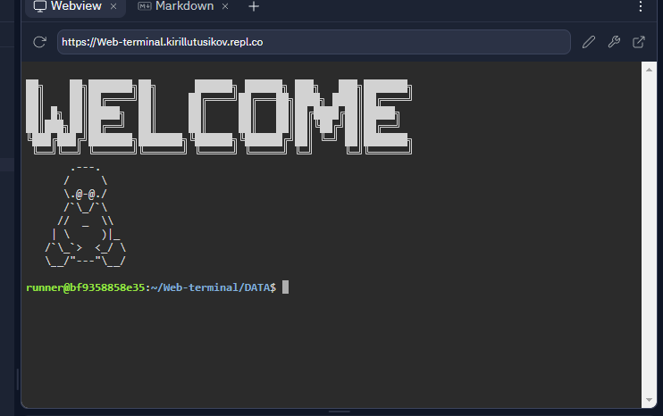

<h1>Welcome</h1>
<h5>Web terminal is an operating system inside browser</h5>
<h6>Note: Web terminal uses your system dont trust any strangers to use web terminal</h6>
<h5>These are rules that you need to know:</h5>
<li>Do not destroy machine</li>
<li>Do not go to system root</li>
<li>Dont remove code</li>
<li>Dont make any files not inside "DATA"</li>
<h5>Heres fast explame of that program:</h5>

<h1>User table</h1>
<table><thead><tr><th>Login</th><th>Password</th><th>Desc</th><th>Devs use?</th></tr></thead><tbody><tr><td>user</td><td>123</td><td>A normal user for new</td><td>yes</td></tr><tr><td>root</td><td>toor</td><td>Root mode. (no su)</td><td>yes (sometimes)</td></tr><tr><td>123</td><td>123</td><td>a basic user</td><td>no</td></tr><tr><td>abcd</td><td>efgh</td><td>a basic user</td><td>no</td></tr><tr><td>login</td><td>password</td><td>for these who dont know</td><td>no</td></tr></tbody></table>
<h5>one more note: this is from replit.<h5>
